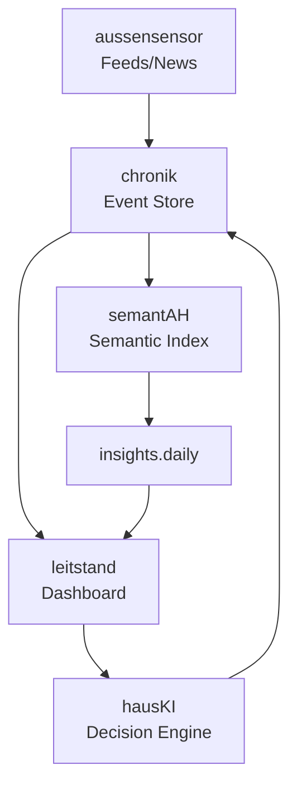

# Leitstand – Data Flow & Required Inputs

Dieses Dokument beschreibt die Datenströme, die der Leitstand konsumiert.
Es ist die verbindliche Sicht auf den Organismus-Fluss:

    aussensensor → chronik → semantAH → leitstand → hausKI → chronik

Leitstand ist damit das „Regelzentrum“ des Heimgewebes.

---

## 1. Eingehende Datenströme (Stand heute)

Leitstand konsumiert **Stand heute** drei zentrale Contract-Typen. Weitere können in Zukunft hinzukommen.

### 1.1 `fleet.health`
Schema: `contracts/fleet.health.schema.json`

Quelle:
  - wgx metrics (periodisch)
  - leitstand-intern generierte Aggregationen

Bedeutung:
  - zeigt den Zustand der gesamten Fleet
  - wird in Panels wie „Fleet Overview“ verwendet

---

### 1.2 `insights.daily`
Schema (semantische Ebene):
  → `contracts/insights.daily.schema.json`

Technische Grundlage (Feldtypen, Validierung):
  → `contracts/insights.schema.json`

Hinweis:
`insights.daily.schema.json` ist die **Daily-Spezialisierung** des allgemeineren
`insights.schema.json`. Leitstand validiert primär gegen das Daily-Schema;
`insights.schema.json` definiert die geteilten Feldstrukturen.

Quelle:
  - semantAH (`.gewebe/insights/daily/YYYY-MM-DD.json`)

Garantierte Felder:
  - `ts: YYYY-MM-DD`
  - `topics`: Liste thematischer Einträge, sortiert nach Relevanz
    (konkrete Struktur → `insights.daily.schema.json`, Feldtypen → `insights.schema.json`)
  - `questions: [...]`
  - `deltas: [...]`
  - optional: `source`, `metadata`

Verwendung:
  - semantische Tagesansicht
  - Trendanalysen über mehrere Tage

**Atomizität:**
Daily-Dateien werden atomar erzeugt (tmp → rename).
Leitstand liest nie „teilbeschriebene“ Dateien; entweder die alte oder eine vollständig neue Version.

---

### 1.3 `event.line`
Schema: `contracts/event.line.schema.json`

Quelle:
  - chronik (JSONL)

Verwendung:
  - „Recent Activity“
  - Filterbares Logbuch

---

## 2. Aktualisierungsfrequenzen

- `fleet.health` – bei jedem wgx-guard/smoke Lauf, min. täglich
- `insights.daily` – 1× täglich, bereit bis 08:00
- `event.line` – kontinuierlich, Append-only

Leitstand verarbeitet diese Daten asynchron; fehlende Quellen werden angezeigt, nicht verschwiegen.

---

## 3. Fehler- und Toleranzregeln

### 3.1 Fehlende Dateien
- `insights.daily`: wenn `today.json` fehlt → Panel zeigt „Keine Insights heute“
- `fleet.health`: falls kein Health-Snapshot → Warnung
- `event.line`: falls leer → Panel bleibt leer, Leitstand fährt trotzdem hoch

### 3.2 Ungültige Schemas
- Leitstand validiert Inputs gegen die Contracts
- Bei Verstoß:
  - Datei wird ignoriert
  - Eintrag erscheint im internen „Diagnostics“-Panel

---

## 4. Organismus-Graph

---

Dies ist die verbindliche Datensicht, nach der Leitstand implementiert wird.
