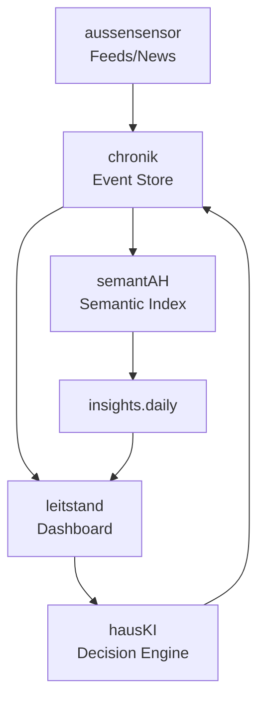

# Leitstand – Data Flow & Required Inputs

Dieses Dokument beschreibt die Datenströme, die der Leitstand konsumiert.
Es ist die verbindliche Sicht auf den Organismus-Fluss:

    aussensensor → chronik → semantAH → leitstand → hausKI → chronik

Leitstand ist damit das **Beobachtungs- und Visualisierungszentrum** des Heimgewebes.

Wichtig (Invariante, bezogen auf den Kern-Datenpfad `aussensensor → chronik → semantAH → leitstand → hausKI → chronik`):
- Leitstand **orchestriert nicht** und **mutiert keine externen Systeme** im Normalbetrieb entlang dieses Datenpfads.
- Leitstand konsumiert Artefakte/Events und erzeugt entlang dieses Pfads lediglich **lokale Darstellungs-/Digest-Artefakte**.
- Ausnahme (bewusstes, optionales Fallback): Wenn `LEITSTAND_OPS_ALLOW_JOB_FALLBACK=true` gesetzt ist, kann der Ops Viewer POST-Requests an acs (`/api/audit/git`) auslösen; dies ist ein explizit opt-in konfigurierter externer Seiteneffekt außerhalb des Kern-Datenpfads.

---

## 1. Eingehende Datenströme (Stand heute)

Leitstand konsumiert **Stand heute** drei zentrale Contract-Typen. Weitere können in Zukunft hinzukommen.

### 1.1 `fleet.health`
Schema: `contracts/fleet.health.schema.json`

Quelle:
  - wgx metrics (periodisch)
  - leitstand-intern generierte Aggregationen

Bedeutung:
  - zeigt den Zustand der gesamten Fleet
  - wird in Panels wie „Fleet Overview“ verwendet

---

### 1.2 `insights.daily`
Schema (semantische Ebene):
  → `contracts/insights.daily.schema.json`

Technische Grundlage (Feldtypen, Validierung):
  → `contracts/insights.schema.json`

Hinweis:
`insights.daily.schema.json` ist die **Daily-Spezialisierung** des allgemeineren
`insights.schema.json`. Leitstand validiert primär gegen das Daily-Schema;
`insights.schema.json` definiert die geteilten Feldstrukturen.

Quelle:
  - semantAH (`.gewebe/insights/daily/YYYY-MM-DD.json`)

Garantierte Felder:
  - `ts: YYYY-MM-DD`
  - `topics`: Liste thematischer Einträge, sortiert nach Relevanz
    (konkrete Struktur → `insights.daily.schema.json`, Feldtypen → `insights.schema.json`)
  - `questions: [...]`
  - `deltas: [...]`
  - optional: `source`, `metadata`

Verwendung:
  - semantische Tagesansicht
  - Trendanalysen über mehrere Tage

**Atomizität:**
Daily-Dateien werden atomar erzeugt (tmp → rename).
Leitstand liest nie „teilbeschriebene“ Dateien; entweder die alte oder eine vollständig neue Version.

---

### 1.3 `event.line`
Schema: `contracts/event.line.schema.json`

Quelle:
  - chronik (JSONL)

Verwendung:
  - „Recent Activity“
  - Filterbares Logbuch

---

### 1.4 `leitstand_bureau_task_snapshot` (Ausführungs-Achse)
Contract-`kind`: `leitstand_bureau_task_snapshot` (schemaVersion 1)

Quelle:
  - Primär: `artifacts/bureau-tasks.json`
  - Bureau-Task-/Claim-Zustand, normalisiert durch die Producer-Bridge
    `scripts/export-operator-snapshots.mjs`
  - Dev/Preview-Fixture nur bei explizitem Fallback:
    `LEITSTAND_BUREAU_FIXTURE_FALLBACK=1` oder `LEITSTAND_STRICT=false|0`

Wichtig (Invariante):
  - Leitstand ruft Bureau/Grabowski **nicht zur Laufzeit** auf. Der Zustand kommt
    ausschließlich als Snapshot-Artefakt eines separaten Producers. Fällt
    Leitstand aus, läuft die Ausführungswahrheit ungestört weiter.

Verwendung:
  - Task-Board (`/bureau`): Lifecycle-Zustände, Claims, Blocked/Failed-Zähler.

### 1.5 `leitstand_checkout_inventory` (Ausführungs-Achse)
Contract-`kind`: `leitstand_checkout_inventory` (schemaVersion 1)

Quelle:
  - Primär: `artifacts/checkout-inventory.json`
  - Grabowski-Linked-Checkout-Inventar (`grabowski_checkout_inventory`),
    normalisiert durch dieselbe Producer-Bridge.
  - Dev/Preview-Fixture nur bei explizitem Fallback:
    `LEITSTAND_CHECKOUT_FIXTURE_FALLBACK=1` oder `LEITSTAND_STRICT=false|0`

Verwendung:
  - Checkout Health (`/checkouts`): Retention-Ampel und **Sprawl**-Erkennung
    (Worktrees ohne Retention-Owner, Prozess oder Lease).

Details: siehe [Operator Execution Observability Blueprint](blueprints/operator-execution-observability.md).

---

## 2. Aktualisierungsfrequenzen

- `fleet.health` – bei jedem wgx-guard/smoke Lauf, min. täglich
- `insights.daily` – 1× täglich, bereit bis 08:00
- `event.line` – kontinuierlich, Append-only

Leitstand verarbeitet diese Daten asynchron; fehlende Quellen werden angezeigt, nicht verschwiegen. Fixture-Fallbacks werden als `fixture` angezeigt und gelten nicht als operative Wahrheit.

---

## 3. Fehler- und Toleranzregeln

### 3.1 Fehlende Dateien
- `insights.daily`: wenn `today.json` fehlt → Panel zeigt „Keine Insights heute“
- `fleet.health`: falls kein Health-Snapshot → Warnung
- `event.line`: falls leer → Panel bleibt leer, Leitstand fährt trotzdem hoch

### 3.2 Ungültige Schemas
- Leitstand validiert Inputs gegen die Contracts
- Bei Verstoß:
  - Datei wird ignoriert
  - Eintrag erscheint im internen „Diagnostics“-Panel

---

## 4. Organismus-Graph

```mermaid
flowchart TD
    FEEDS[aussensensor<br/>Feeds/News]
        --> CHRONIK[chronik<br/>Event Store]

    CHRONIK --> SEMANTAH[semantAH<br/>Semantic Index]
    SEMANTAH --> INSIGHTS[insights.daily]

    CHRONIK --> LS[leitstand<br/>Dashboard]
    INSIGHTS --> LS

    LS --> KI[hausKI<br/>Decision Engine]
    KI --> CHRONIK
```

---

Dies ist die verbindliche Datensicht, nach der Leitstand implementiert wird.
